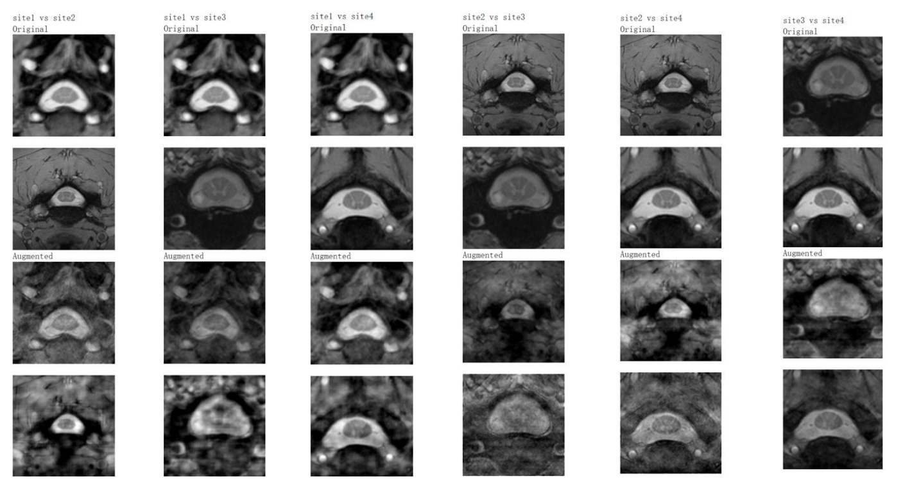

# Domain Generalization on Spinal Cord Gray Matter Segmentation

## Introduction

This project use the fourier-based  method proposed by [FACT](https://arxiv.org/abs/2105.11120]) to improve the domain generalization capbility of model in Medical MRI Segmentation task.

Dataset: The [SCGM (spinal cord gray matter segmentation)](http://niftyweb.cs.ucl.ac.uk/challenge/index.php) dataset contains Spinal Cord MRI data from four different hospitals (UCL, Montreal, Zurich,
Vanderbilt) using three different MRI devices (Philips Acheiva, Siemens Trio, Siemens Skyra) but with hopital-specific parameters. Each hopital is thus a domain. The task is to segment the Spinal Cord (SC) and Grey Matter (GM).

A sample of the SCGM dataset. (Spinal Cord - Green & Grey Matter - Red)

## Requirements

- SimpleITK: 2.5.0
- segmentation_models_pytorch: 0.5.0
- medpy: 0.5.2
- PyTorch: 2.2.0
## Run
`python main.py --data_path PATH_TO_DATASET_FOLDER --model_path PATH_TO_SAVED_MODL`

Note: the model path is needed only when you want to train from a checkpoint.

## Result

Figure (a): The training and validation history of each epoch. The first graph is training loss and Dice 
for Spinal Cord (SC) and Grey Matter (GM). The second graph is validation Dice for SC & GM. The 
thrid graph is validation Average Surface Distance (ASD) for SC & GM.

Figure (b): The comparison of original and augmented MRI images. For each column, the first 2 rows show the original 
MRI and the last 2 rows show the corresponding augmented MRI by mixing the amplitude components of Fourier Transformation. As there are 4 domains and each mixing need 2 domains, there are 6 combinations (6 columns).

Figure (c): The comparison of validation (on seen domains) and test (on unseen domains) results. The model performance on test domains downgrade dramatically, indicating a poor domain generalization capbility.

Figure (d): The comparison of base method and fourier-based augmentation method on test domains (unseen). The model generalization capbility is significantly improved with the augmentation.

